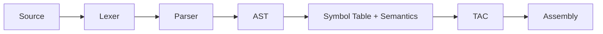
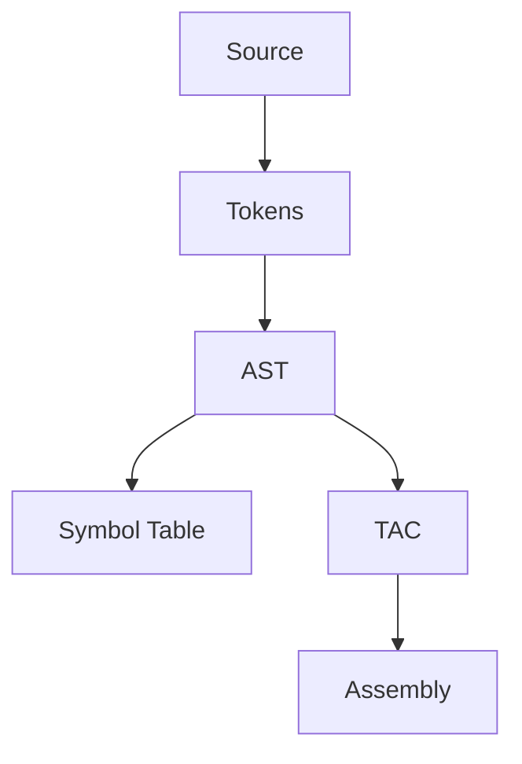
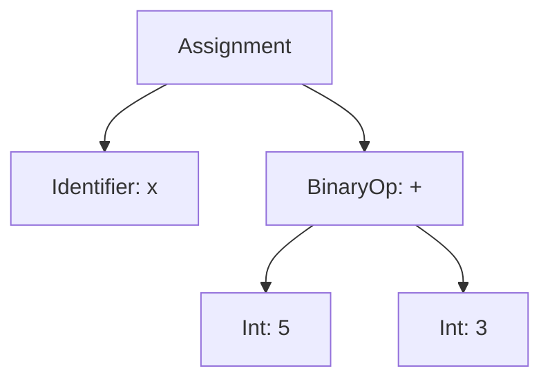
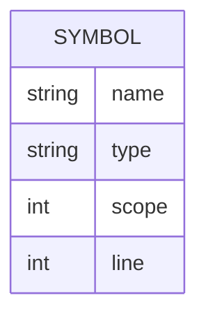

# TinyC Mini Compiler Presentation

## 1. Project Goal
- Build a simple C-like compiler using Flex, Bison, and C
- Output tokens, AST, symbol table, TAC, and pseudo assembly



## 2. Dependencies
```bash
sudo apt update
sudo apt install -y flex bison gcc make
```

## 3. How to Run
**Run all at once**
```bash
make clean
make
./tinyc input/sample.tc
```

**Run step-by-step**
```bash
bison -d -o parser.tab.c src/parser.y
flex -o lex.yy.c src/lexer.l
# compile and link (see report for full list)
./tinyc input/sample.tc
```

## 4. Compiler Phases (Overview)
1. Lexer: source -> tokens
2. Parser: tokens -> AST
3. Semantics: AST + symbol table checks
4. TAC: AST -> intermediate code
5. Assembly: TAC -> pseudo assembly



## 5. Compiler Phases (Details)
**Lexer (Flex)**
- Scans characters and matches regex rules for keywords, identifiers, literals, operators, separators.
- Ignores comments and whitespace, tracks line numbers.
- Emits tokens to output/tokens.txt and passes token IDs to the parser.

**Parser (Bison)**
- Validates grammar and reports syntax errors with line numbers.
- Builds AST nodes in grammar actions using `ast_create()`.
- Prints "Parsing Successful" on valid input.

**AST Construction**
- AST nodes capture statement and expression structure.
- Statement lists are chained using `AST_STMT_LIST` nodes.
- AST is printed to terminal and output/parser_output.txt.

**Symbol Table + Semantics**
- Inserts declarations with name, type, scope, line.
- Detects duplicate declarations and undeclared variable usage.
- Checks simple type mismatches in assignments and expressions.

**TAC Generation**
- Traverses AST and emits three-address code using temporaries.
- Control flow creates labels and conditional jumps.
- Output saved to output/tac.txt.

**Pseudo Assembly Generation**
- Maps TAC operations to readable instructions (MOV, ADD, MUL, CMP, JMP).
- Uses a simple register model for clarity.
- Output saved to output/assembly.asm.

## 6. Inputs and Outputs by Phase
- Lexer
  - Input: .tc source
  - Output: output/tokens.txt
- Parser + AST
  - Input: tokens
  - Output: AST (terminal)
- Symbol Table
  - Input: declarations/uses
  - Output: output/symbol_table.txt
- TAC
  - Input: AST
  - Output: output/tac.txt
- Assembly
  - Input: TAC
  - Output: output/assembly.asm

## 7. Example I/O
Input:
```
int main() {
  int x;
  x = 5 + 3;
  print(x);
  return 0;
}
```

TAC:
```
t1 = 5 + 3
x = t1
print x
return 0
```

Assembly:
```
MOV R1, 5
ADD R1, 3
MOV t1, R1
MOV x, t1
PRINT x
RET 0
```

## 8. Internal Diagrams

AST Example:


Symbol Table (conceptual):

