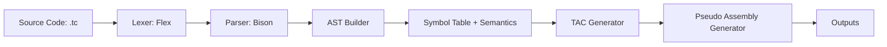
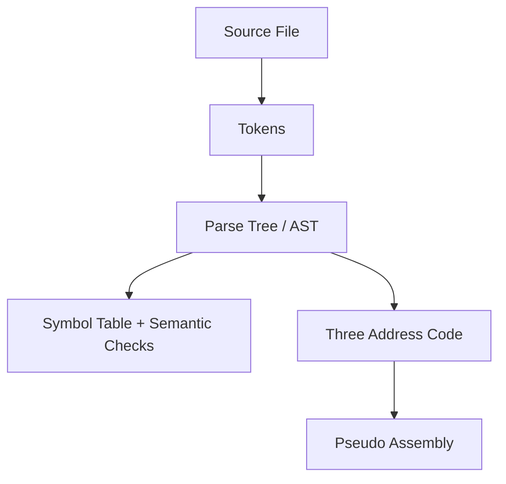
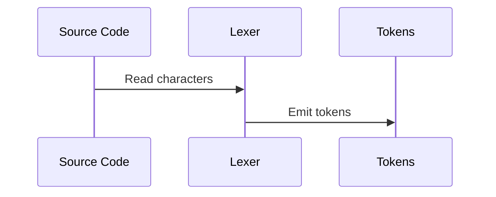
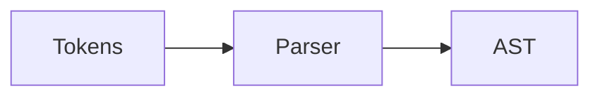
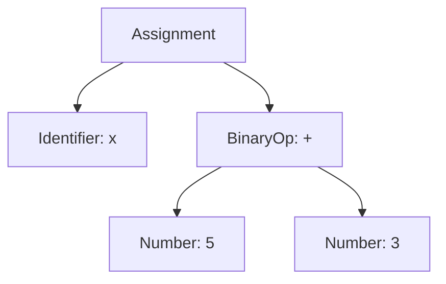
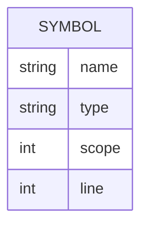
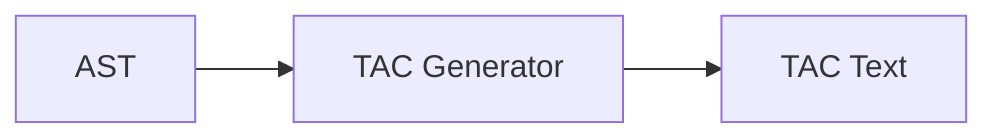
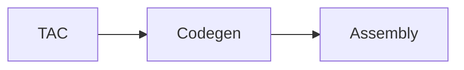

# TinyC Mini Compiler Project Report

## Part 1: Design

### 1.1 Problem Definition
The goal is to build a simple, modular, educational compiler named TinyC. TinyC supports a small C-like language with variable declarations, expressions, assignments, if-else, while, print(), and return statements. The compiler is implemented using Flex, Bison, and standard C, and produces multiple outputs: tokens, AST, symbol table, TAC, and pseudo assembly.

### 1.2 Goals and Constraints
- Beginner-friendly design and code
- Standard C only
- Clear, modular structure
- No advanced optimizations or complex data structures
- Output of each compiler phase to files and terminal

### 1.3 High-Level Architecture
TinyC follows a classic compiler pipeline with sequential phases.



### 1.4 TinyC Grammar Overview (Simplified)
Supported statements and expressions:
- Declarations: int x; float y;
- Assignments: x = 5 + y;
- If-else: if (x > 0) { ... } else { ... }
- While: while (x < y) { ... }
- Print: print("text"); or print(x);
- Return: return; or return expr;

### 1.5 Data Flow Between Phases



---

## Part 2: Implementation

### 2.1 Folder Structure
```
CSE_430_TinyC/
├── src/
│   ├── lexer.l
│   ├── parser.y
│   ├── symbol_table.c
│   ├── symbol_table.h
│   ├── ast.c
│   ├── ast.h
│   ├── tac.c
│   ├── tac.h
│   ├── codegen.c
│   ├── codegen.h
│   └── main.c
├── input/
│   └── sample.tc
├── output/
│   ├── tokens.txt
│   ├── symbol_table.txt
│   ├── tac.txt
│   └── assembly.asm
├── Makefile
└── README.md
```

### 2.2 Lexer (Flex)
- Input: TinyC source code
- Output: tokens to output/tokens.txt and terminal
- Responsibilities:
  - Recognize keywords, identifiers, literals, operators, separators
  - Ignore comments and whitespace
  - Track line numbers

**Implementation Logic (Code-Level)**
- The lexer patterns are defined using regular expressions for identifiers, numbers, strings, and operators.
- Each matched token calls a small helper that prints a formatted line to the token output file.
- For parser integration, tokens return a token ID (from parser.tab.h) and store values in `yylval`.
- Comments (`//` and `/* ... */`) are ignored using start conditions, while whitespace is skipped.
- Line numbers are tracked using `yylineno` for accurate error messages.

**Lexer I/O**
- Input: .tc source file
- Output: token list, example:
  - KEYWORD int
  - IDENTIFIER x
  - OPERATOR =
  - INTEGER 5



### 2.3 Parser (Bison)
- Input: tokens from lexer
- Output: AST and syntax validation
- Grammar supports declarations, assignments, expressions, if/else, while, print, return
- On success prints "Parsing Successful"

**Implementation Logic (Code-Level)**
- Grammar rules create AST nodes in each semantic action using `ast_create()`.
- Statement lists are built using a linked-list style AST node (`AST_STMT_LIST`) via `ast_append()`.
- The parser also triggers symbol table actions: declaration rules call `symtab_insert()`.
- Expressions are evaluated for simple type compatibility (int/float) to catch mismatches early.
- `yyerror()` prints syntax errors with line numbers for missing semicolons, braces, or invalid tokens.

**Parser I/O**
- Input: token stream
- Output: AST root



### 2.4 AST (Abstract Syntax Tree)
- Nodes for declarations, assignments, expressions, control flow, print, return
- Printed in indented form to terminal

**Implementation Logic (Code-Level)**
- `ast_create()` builds nodes with `kind`, `text`, and up to three child pointers.
- `AST_STMT_LIST` nodes are used to chain sequential statements without complex containers.
- `ast_print()` and `ast_print_to_file()` recursively print the tree with indentation.
- The AST is the core structure used by TAC generation; it avoids parsing text again.

**AST I/O**
- Input: parser actions
- Output: AST structure



### 2.5 Symbol Table and Semantic Checks
- Tracks name, type, scope, line
- Checks:
  - Duplicate declarations
  - Undeclared usage
  - Type mismatch in assignments

**Implementation Logic (Code-Level)**
- The symbol table is a simple linked list with `name`, `type`, `scope`, and `line`.
- `symtab_enter_scope()` and `symtab_leave_scope()` manage scope depth for `{}` blocks.
- `symtab_insert()` checks duplicates in the current scope and records new variables.
- `symtab_get_type()` is used in expressions to detect undeclared variables.
- Semantic errors are reported immediately during parsing with line numbers.

**Symbol Table I/O**
- Input: declarations and identifier use
- Output: output/symbol_table.txt



### 2.6 Three Address Code (TAC)
- Generated from AST
- Uses temporaries t1, t2, ...

**Implementation Logic (Code-Level)**
- The TAC generator traverses the AST recursively.
- Expressions return a temporary name (`t1`, `t2`, ...) created by `new_temp()`.
- Control flow (if/else, while) is translated using labels and conditional jumps.
- TAC instructions are stored in a linked list, then printed to output/tac.txt.

**TAC I/O**
- Input: AST
- Output: output/tac.txt

Example:
```
t1 = b * c
t2 = a + t1
x = t2
```



### 2.7 Pseudo Assembly Generation
- Converts TAC into simple assembly-like instructions

**Implementation Logic (Code-Level)**
- Each TAC instruction is mapped to a small sequence of pseudo assembly.
- Arithmetic uses a simple register `R1` to keep output easy to understand.
- Conditional TAC operations are translated to `CMP` + jump instructions.
- The output is textual only and is intended for learning, not real execution.

**Assembly I/O**
- Input: TAC
- Output: output/assembly.asm

Example:
```
MOV R1, b
MUL R1, c
ADD R1, a
MOV x, R1
```



### 2.8 Main Driver
- Orchestrates all phases
- Writes outputs to files and prints them to terminal

**Implementation Logic (Code-Level)**
- Opens input and all output files at startup.
- Connects the lexer to the token output file via `g_token_out`.
- Runs `yyparse()`; on success, prints AST, symbol table, TAC, and assembly.
- Writes parser output to output/parser_output.txt and prints all output files to terminal.

---

## Part 3: Results

### 3.1 Sample Input
```
int main() {
    int x;
    int y;

    x = 5;
    y = x + 10;

    if (y > 10) {
        print("Large");
    } else {
        print("Small");
    }

    while (x < y) {
        x = x + 1;
    }

    return 0;
}
```

### 3.1.1 Additional Input Programs (For Demonstration)

**Input A: Declarations + Assignments**
```
int main() {
  int a;
  int b;
  a = 3;
  b = a + 7;
  print(b);
  return 0;
}
```

**Input B: If-Else + While**
```
int main() {
  int x;
  x = 0;
  while (x < 3) {
    if (x == 2) {
      print("Two");
    } else {
      print("Other");
    }
    x = x + 1;
  }
  return 0;
}
```

**Input C: Semantic Errors (Duplicate + Undeclared)**
```
int main() {
  int x;
  int x;
  y = 10;
  return 0;
}
```

**Input D: Arithmetic Precedence**
```
int main() {
  int a;
  int b;
  a = 2 + 3 * 4;
  b = (2 + 3) * 4;
  print(a);
  print(b);
  return 0;
}
```

**Input E: Nested If-Else**
```
int main() {
  int n;
  n = 5;
  if (n > 0) {
    if (n > 3) {
      print("Big");
    } else {
      print("Small");
    }
  } else {
    print("Negative");
  }
  return 0;
}
```

**Input F: While Loop with Decrement**
```
int main() {
  int i;
  i = 3;
  while (i > 0) {
    print(i);
    i = i - 1;
  }
  return 0;
}
```

**Input G: Mixed Types (int + float)**
```
int main() {
  int x;
  float y;
  x = 2;
  y = x + 1.5;
  print(y);
  return 0;
}
```

**Input H: Function Above main (Addition)**
```
int add() {
  int a;
  int b;
  a = 2;
  b = 3;
  print(a + b);
  return 0;
}

int main() {
  int x;
  x = 10;
  print(x);
  return 0;
}
```

**Input I: Function Above main (Maximum)**
```
int maximum() {
  int a;
  int b;
  a = 7;
  b = 5;
  if (a > b) {
    print(a);
  } else {
    print(b);
  }
  return 0;
}

int main() {
  int v;
  v = 1;
  print(v);
  return 0;
}
```

### 3.2 Outputs by Compiler Phase

#### 3.2.1 Tokens (Lexer)
- File: output/tokens.txt
- Terminal: Printed after run

#### 3.2.2 AST (Parser + AST)
- Terminal output in indented form

#### 3.2.3 Symbol Table
- File: output/symbol_table.txt
- Columns: Name, Type, Scope, Line

#### 3.2.4 TAC
- File: output/tac.txt

#### 3.2.5 Pseudo Assembly
- File: output/assembly.asm

### 3.3 Run and Build Instructions

**Dependencies (WSL Ubuntu)**
```bash
sudo apt update
sudo apt install -y flex bison gcc make
```

**Run step-by-step (manual)**
```bash
bison -d -o parser.tab.c src/parser.y
flex -o lex.yy.c src/lexer.l

gcc -Wall -Wextra -g -Isrc -c parser.tab.c
gcc -Wall -Wextra -g -Isrc -c lex.yy.c
gcc -Wall -Wextra -g -Isrc -c src/ast.c -o src/ast.o
gcc -Wall -Wextra -g -Isrc -c src/symbol_table.c -o src/symbol_table.o
gcc -Wall -Wextra -g -Isrc -c src/tac.c -o src/tac.o
gcc -Wall -Wextra -g -Isrc -c src/codegen.c -o src/codegen.o
gcc -Wall -Wextra -g -Isrc -c src/main.c -o src/main.o

gcc -Wall -Wextra -g -Isrc -o tinyc parser.tab.o lex.yy.o src/ast.o src/symbol_table.o src/tac.o src/codegen.o src/main.o -lfl
./tinyc input/sample.tc
```

**Run all at once**
```bash
make clean
make
./tinyc input/sample.tc
```

### 3.4 High-Level Working Procedure (Overview)
1. The lexer scans the source and emits tokens.
2. The parser validates syntax and constructs the AST.
3. The symbol table is populated and semantic checks run.
4. TAC is generated from the AST.
5. TAC is converted into pseudo assembly.
6. All outputs are printed to terminal and saved to output/.

### 3.5 Detailed Working Procedure
- **Lexical Analysis**: The Flex lexer reads characters and emits tokens for keywords, identifiers, literals, operators, and separators. Comments and whitespace are ignored. Each token is written to output/tokens.txt.
- **Syntax Analysis**: The Bison parser consumes tokens and validates grammar rules. On success it prints "Parsing Successful". During parsing, AST nodes are created for each statement and expression.
- **AST Construction**: AST nodes represent statements and expressions as a tree. This allows later phases to process the program structure easily. The AST is printed in a readable indented format.
- **Symbol Table + Semantics**: Each declaration inserts a symbol with name, type, scope, and line number. If a variable is re-declared in the same scope, an error is reported. If a variable is used without declaration, an error is reported. Simple type mismatch checks run during assignment.
- **TAC Generation**: Each expression is translated into three-address code using temporaries (t1, t2, ...). Control flow statements produce labels and conditional jumps. The TAC is written to output/tac.txt.
- **Pseudo Assembly**: TAC is translated into a simplified assembly format with MOV, ADD, MUL, CMP, JMP, and PRINT instructions. This output is written to output/assembly.asm.

---

## Conclusion
TinyC demonstrates the essential phases of a compiler in a clean, beginner-friendly way. The modular design allows each stage to be studied independently while still working together as a complete pipeline.
